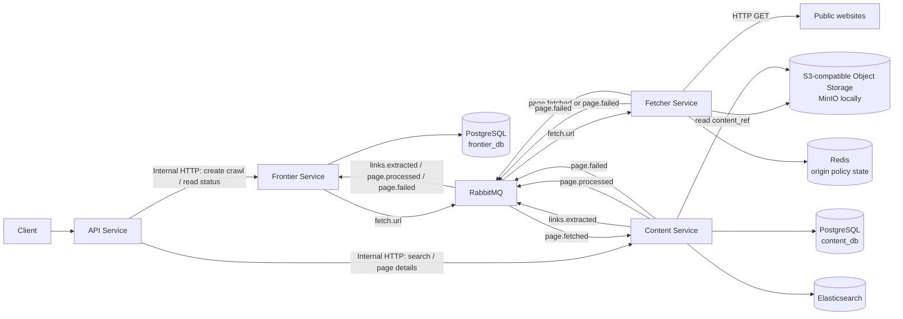

# Web Crawler Architecture

## Purpose

The system crawls public HTML pages from one or more seed URLs, builds a directed link graph, extracts page text and keywords, and provides full-text search.

The architecture uses four independently deployable services. Every service has its own Python project, dependency lock file, virtual environment, Docker image, and runtime configuration. RabbitMQ transports asynchronous crawl work. PostgreSQL stores authoritative crawler and content data. Redis coordinates outbound HTTP policy across Fetcher replicas. Object storage retains raw fetched content. Elasticsearch serves the content search index.

## Goals

- Crawl URLs reachable from configured seed URLs.
- Store every discovered page as a graph node and every discovered hyperlink as a graph edge.
- Fetch each normalized URL at most once per crawl run.
- Extract page title, visible text, links, and weighted keywords.
- Search indexed content by words and phrases.
- Scale HTTP fetching independently from API traffic and content processing.
- Operate safely against untrusted URLs and unreliable external websites.

## Scope

The first release supports public HTTP and HTTPS HTML pages. It does not execute JavaScript, submit forms, crawl authenticated pages, or parse PDF documents. These are separate capabilities with different resource and security requirements.

## Architecture Overview



### Data flow

1. The API Service accepts seed URLs and creates a crawl through the Frontier Service's internal HTTP API.
2. Frontier stores new URLs and publishes a `fetch.url` message for each accepted URL.
3. Fetcher consumes the message, publishes `fetch.started`, downloads the page within the configured response-size limit, stores its raw HTML in object storage, and publishes either `page.fetched` with `content_ref` or `page.failed`.
4. Content consumes successful pages, reads raw HTML from object storage using `content_ref`, extracts content and links, saves content data, and indexes the page.
5. Content publishes `links.extracted` and `page.processed`.
6. Frontier saves graph edges, admits only new URLs, and marks processed pages as fetched.
7. The API Service retrieves search and page data from Content's internal HTTP API and crawl status from Frontier.

## Technology Choices

| Technology | Role | Reason                                                                                   |
|---|---|------------------------------------------------------------------------------------------|
| Python 3.12+ | Service runtime | Shared language and mature async ecosystem                                               |
| FastAPI | HTTP APIs | Typed request models, OpenAPI, async support                                             |
| Pydantic | API and message contracts | Strict validation at service boundaries                                                  |
| aiohttp | Outbound HTTP | Async client, connection pools, timeouts, streaming responses                            |
| aio-pika | RabbitMQ client | Async AMQP producer and consumer support                                                 |
| SQLAlchemy async + asyncpg | PostgreSQL access | Typed models, migrations, async database access                                          |
| Alembic | Schema migrations | Versioned, reviewable database migrations                                                |
| PostgreSQL | Authoritative data | URL uniqueness, crawl state, graph edges, page metadata                                  |
| Elasticsearch | Content search index | Full-text search, relevance scoring, highlighting                                        |
| Redis | Fetcher coordination | Atomic per-origin rate limiting and circuit-breaker state across replicas                |
| aioboto3 + S3-compatible object storage | Raw fetched content | Async S3 client; keeps raw HTML out of RabbitMQ; MinIO provides the local implementation |
| selectolax | HTML parsing | Fast, lightweight HTML parsing                                                           |
| Docker Compose | Local and single-host deployment | Reproducible service and infrastructure startup                                          |
| uv | Dependency management | Independent lock files and virtual environments per service                              |

## RabbitMQ

The broker uses a topic exchange named `crawler.topic`.

| Routing key | Queue | Producer | Consumer | Payload |
|---|---|---|---|---|
| `fetch.url` | `fetch.url.queue` | Frontier | Fetcher | `crawl_id`, `url_id`, `url`, `depth`, `fetch_attempt` |
| `fetch.started` | `fetch.started.queue` | Fetcher | Frontier | URL identity, fetch attempt identity, and lease duration |
| `page.fetched` | `page.fetched.queue` | Fetcher | Content | URL identity, status, content type, and object-storage `content_ref` |
| `links.extracted` | `links.extracted.queue` | Content | Frontier | Source URL identity and extracted links |
| `page.processed` | `page.processed.queue` | Content | Frontier | URL identity, page identity, processing outcome |
| `page.failed` | `page.failed.queue` | Fetcher or Content | Frontier | URL identity, pipeline stage, error category, and `fetch_attempt` |

Every message includes `event_id`, `crawl_id`, and `created_at`. Events in the current fetch pipeline also include `fetch_attempt`, which identifies the fetch lifecycle attempt and lets consumers reject stale results. Consumers acknowledge a message only after their local state is saved. A consumer may receive a message more than once, so all consumers must be idempotent. `page.fetched` contains metadata and an opaque object-storage reference; RabbitMQ never transports raw HTML.

Messages that exceed the configured retry limit are routed to a dead-letter queue. The dead-letter queue is monitored and can be replayed after the underlying issue is fixed.

## Services

### API Service

The API Service is the public entry point. It has no crawler business state of its own.

Responsibilities:

- Create a crawl from one or more seed URLs.
- Return crawl status and counters.
- Forward search queries to Content.
- Return page metadata and keywords from Content.
- Protect administrative write operations with an API key.

Public read-only search can remain unauthenticated. Creating, stopping, or changing a crawl is an administrative action because it consumes network, queue, and database resources.

Endpoints:

| Method | Path | Description |
|---|---|---|
| `POST` | `/crawls` | Create a crawl from `start_urls` |
| `GET` | `/crawls/{crawl_id}` | Return crawl state and counters |
| `GET` | `/search?q=...` | Search indexed pages |
| `GET` | `/pages/{page_id}` | Return stored page metadata and keywords |

API calls `POST /internal/crawls` and `GET /internal/crawls/{crawl_id}` on Frontier. It calls `GET /internal/search` and `GET /internal/pages/{page_id}` on Content. These calls use aiohttp as an internal asynchronous HTTP client; API does not connect to service databases or Elasticsearch.

Dependencies: FastAPI, Pydantic, aiohttp as the internal HTTP client, Uvicorn, shared contracts.

### Frontier Service

Frontier owns crawl scheduling, URL identity, URL deduplication, and graph storage. It is the only service allowed to decide whether a URL becomes a fetch task.

Responsibilities:

- Create and track crawl runs.
- Normalize and validate URLs.
- Apply scope, depth, and crawl-size limits.
- Store URL nodes and link edges.
- Publish fetch tasks for newly discovered URLs.
- Consume links, processing results, and failures.
- Manage fetch leases and recover abandoned fetch attempts.
- Expose internal endpoints for crawl creation and status.

Dependencies: FastAPI, SQLAlchemy async, asyncpg, Alembic, aio-pika, shared contracts.

### Fetcher Service

Fetcher is a horizontally scalable worker. It receives a URL and returns an HTTP result. It does not decide which URLs to crawl and does not parse HTML.

Responsibilities:

- Consume `fetch.url` messages.
- Fetch a URL with aiohttp.
- Enforce outbound HTTP safety controls.
- Enforce a maximum response size before accepting a response.
- Store accepted HTML in object storage under a deterministic object key.
- Publish `fetch.started` before processing a task and `page.fetched` after successfully storing the accepted HTML.
- Publish `page.failed` for final failures.
- Retry transient errors using exponential backoff and jitter.

Dependencies: aiohttp, aio-pika, redis-py, aioboto3, shared contracts.

Multiple Fetcher containers can consume the same queue. RabbitMQ distributes each fetch message to one consumer.

### Content Service

Content transforms downloaded HTML into application data and search documents.

Responsibilities:

- Consume `page.fetched` messages.
- Read raw HTML from object storage through `content_ref`.
- Extract page title, visible text, canonical URL hint, and hyperlinks.
- Resolve relative links against the fetched page URL.
- Extract and score keywords.
- Store pages and page-keyword relationships in PostgreSQL.
- Index searchable fields in Elasticsearch.
- Publish extracted links, the page processing result, or a final processing failure.
- Expose internal read-only endpoints for search and page details.

Dependencies: FastAPI, Pydantic, Uvicorn, selectolax, SQLAlchemy async, asyncpg, Alembic, Elasticsearch client, aio-pika, aioboto3, shared contracts.

## URL Identity, Deduplication, and Cycles

Hyperlinks create a directed graph. A cycle is valid graph data and must be stored; it must not cause a page to be fetched repeatedly.


In this example, A and B form a cycle and C links to itself. The crawler stores all four edges but fetches A, B, and C only once per crawl.

Frontier normalizes every URL before storing it:

- Allow only `http` and `https` schemes.
- Resolve relative URLs before normalization.
- Remove fragments such as `#section`.
- Lowercase the hostname.
- Remove the default port for the scheme.
- Convert an empty path to `/`, so `http://example.com` and `http://example.com/` have one identity.
- Reject malformed URLs, userinfo, and URLs exceeding the configured size limit.

Query parameters are preserved. The crawler does not sort, remove, or rewrite them because they can change page meaning. It does not equate `/path` and `/path/`. The original URL is retained for diagnostics; the normalized URL is used for uniqueness.

Each crawl has an allowed-host policy. By default, only URLs whose normalized hostname exactly matches a seed hostname are eligible for fetching. Frontier records an out-of-scope link as a graph edge and marks its URL as `skipped`; it never creates a fetch task for it. An explicit allowlist can extend the policy when a crawl must cover several hosts.

The `crawl_urls` table has a database constraint:

```sql
UNIQUE (crawl_id, normalized_url)
```

When Frontier receives a URL, it inserts it using `INSERT ... ON CONFLICT DO NOTHING`. A successful insert means the URL is new and creates a durable `fetch.url` outbox event. A conflict means the URL was already discovered; Frontier stores the edge but does not create another fetch task.

This database constraint protects against cycles, duplicate links on one page, and races between multiple Content workers.

## Data Storage

### `frontier_db`

| Table | Purpose |
|---|---|
| `crawls` | Crawl ID, state, timestamps, limits, and counters |
| `crawl_urls` | One normalized URL per crawl, depth, status, fetch lease, and error details |
| `links` | Directed graph edges between source and target URLs |
| `outbox_events` | Durable events waiting for RabbitMQ publisher confirmation |
| `processed_events` | Consumed handler and event IDs; `UNIQUE (consumer_name, event_id)` enforces idempotency |

URL statuses follow this state flow:

```text
queued → fetching → fetched
queued or fetching → failed
fetching → queued (retry or expired lease)
queued → skipped
```

`fetched` means that Content successfully persisted and indexed the page. An HTTP 200 response alone does not mark a URL as fetched.

`fetch.started` moves a URL from `queued` to `fetching` and sets `lease_until`. Frontier accepts `fetch.started` only when its `fetch_attempt` matches the currently scheduled attempt. A recovery task periodically finds `fetching` rows with expired leases. It schedules a new bounded attempt through the retry-delay queue, or marks the URL `failed` when the attempt limit is exhausted. A worker crash after `fetch.started` therefore cannot leave a URL in `fetching` forever.

The initial Frontier policy uses a maximum of 3 fetch attempts, a 120-second fetch lease, and a 4,096-character URL limit. These values are validated configuration, not hard-coded scheduling decisions; deployment environment variables will supply them when the service runtime is added.

### `content_db`

| Table | Purpose |
|---|---|
| `pages` | Fetched page metadata, title, extracted text, and HTTP status |
| `keywords` | Normalized keyword dictionary |
| `page_keywords` | Page-to-keyword relationship and score |
| `outbox_events` | Durable events waiting for RabbitMQ publisher confirmation |
| `processed_events` | Consumed handler and event IDs; `UNIQUE (consumer_name, event_id)` enforces idempotency |

PostgreSQL is the authoritative source of truth. Elasticsearch stores a rebuildable search projection of a page: `page_id`, `crawl_id`, `url`, `title`, `text`, and `keywords`. If the index is lost or its mapping changes, Content rebuilds it from `content_db`.

Each service owns its database. Frontier connects only to `frontier_db`; Content connects only to `content_db` and Elasticsearch. API has no direct storage connection and requests data through Frontier and Content internal APIs.

### Object storage

Object storage holds raw HTML snapshots accepted by Fetcher. It is infrastructure, not a crawler business service: production deployments use an S3-compatible provider and local Docker Compose uses MinIO.

Fetcher uploads an accepted response before publishing `page.fetched`. Its deterministic object key is `crawls/{crawl_id}/urls/{url_id}/fetches/{fetch_attempt}.html`. Including `fetch_attempt` prevents a late result from an older attempt from overwriting a newer response. `content_ref` is that opaque key; it never exposes the storage endpoint, bucket credentials, or a presigned URL in RabbitMQ.

Fetcher and Content use `aioboto3` with an async S3 client. The client receives its endpoint and credentials through environment variables, uses Signature Version 4, and forces `addressing_style="path"`. Path-style access works with MinIO's default configuration; virtual-host style would require `MINIO_DOMAIN` and matching DNS configuration. Content reads the object through this client. Transient object-storage read failures are retried according to the Content retry policy; a confirmed missing object is treated as a processing failure. Lifecycle rules remove raw snapshots after the configured retention period; PostgreSQL remains the authoritative source for processed page data.

## Reliability and Safety Controls

These controls belong to existing services; they do not require additional microservices.

### Fetcher controls

| Control | Behavior |
|---|---|
| Connection pool | One `aiohttp.ClientSession` per process with a configured total connection limit |
| Timeouts | Separate connect, socket-read, and total request timeouts |
| Response limit | Stream the body and stop after the configured maximum size |
| Object upload | Upload accepted HTML before publishing `page.fetched`; use a deterministic key based on `crawl_id`, `url_id`, and `fetch_attempt` |
| MIME validation | Process only HTML and XHTML content types |
| Retry policy | Retry connection errors, timeouts, 408, 429, and selected 5xx responses |
| Exponential backoff | Increase delay after each failure, capped at a configured maximum |
| Jitter | Randomize each retry delay to prevent synchronized retry bursts |
| `Retry-After` | Respect server-provided retry delay when present |
| Rate limit | Limit concurrent requests and minimum delay per origin |
| Circuit breaker | Open after repeated failures for an origin, pause requests, then probe after cooldown |
| Redirects | Disable automatic redirects; validate every redirect target before following it |
| SSRF protection | Resolve the hostname, validate every resolved address against blocked ranges immediately before connecting, and repeat this check for every redirect target to resist DNS rebinding |

Fetcher owns outbound HTTP policy. All Fetcher replicas coordinate through Redis:

- An atomic Redis Lua script implements the per-origin token bucket or minimum-delay check.
- Redis stores the circuit-breaker state, failure count, and cooldown for each origin.
- A Fetcher acquires origin permission before opening an HTTP connection.
- If Redis is unavailable, Fetcher does not bypass the policy. It routes the task to a delayed retry queue with bounded attempts; exhaustion sends it to the DLQ.

`redis-py` provides an asyncio client, shared connection pool support, and Lua script registration for atomic operations. [redis-py asyncio documentation](https://redis.readthedocs.io/en/stable/examples/asyncio_examples.html).

### Internal service APIs

Frontier exposes `POST /internal/crawls` and `GET /internal/crawls/{crawl_id}`. Content exposes `GET /internal/search` and `GET /internal/pages/{page_id}`. These endpoints are reachable only on the internal network; the API Service validates the public request, forwards it, and returns the response. Neither API request handler queries a service-owned database or Elasticsearch directly.

### Content controls

- Parse HTML without executing JavaScript.
- Limit the number of extracted links and the size of extracted text.
- Treat HTML, URLs, and headers as untrusted input.
- Store and return text safely; never render source HTML as trusted application HTML.
- Make page persistence idempotent using `url_id` and `UNIQUE (consumer_name, event_id)` in `processed_events`.

### API controls

- Validate URL count, search length, page size, and filter values with Pydantic.
- Require `ADMIN_API_KEY` for crawl creation and other write operations.
- Keep service-to-service endpoints on the internal Docker network.
- Avoid logging query parameters that can contain sensitive values.
- Add request rate limiting before exposing the API to the Internet.

### Broker controls

- Use durable exchanges and queues.
- Publish persistent messages.
- Use manual acknowledgements.
- Configure a dead-letter exchange for each processing queue.
- Use bounded retry-delay queues with message TTL and dead-letter routing; do not immediately requeue a throttled or transiently failed task.
- Set a bounded prefetch value so one worker does not claim an unlimited number of messages.

## Reliable Event Delivery

Publishing a message after a successful database commit is not sufficient. A process can stop after the commit and before publishing, leaving a URL or extracted link permanently undispatched.

Frontier and Content use the transactional outbox pattern:

1. A service performs its business update and inserts an `outbox_events` row in the same PostgreSQL transaction.
2. An outbox publisher loop reads unpublished rows.
3. It publishes a durable RabbitMQ message with publisher confirms enabled.
4. Only after RabbitMQ confirms receipt does it mark the outbox row as published.
5. If the process stops at any point, the publisher retries the same `event_id`.

Both services keep their own `processed_events` table. Its unique constraint is `UNIQUE (consumer_name, event_id)`, allowing independently named handlers in the same service while preventing one handler from applying the same event twice. A consumer records the event and its PostgreSQL changes in one transaction. Redelivery never duplicates those writes or outgoing events. When an event also has an unfinished external effect, such as Elasticsearch indexing, its stored processing state lets the consumer resume that effect before acknowledging the message.

### Frontier delivery flow

```text
transaction
├── insert crawl_urls row
├── insert graph edge, if present
└── insert fetch.url outbox event
    ↓ commit
outbox publisher → RabbitMQ publisher confirm → mark event published
```

An existing URL can have an unpublished outbox event, so duplicate URL admission never loses a task after a process failure.

### Content delivery flow

```text
consume page.fetched
    ↓
transaction: save page, keywords, processed_events, and mark indexing pending
    ↓
index the page in Elasticsearch with page_id as a deterministic document ID
    ↓
transaction: mark page indexed and insert links.extracted and page.processed outbox events
    ↓
ack page.fetched
```

If Content stops before the final acknowledgement, RabbitMQ redelivers `page.fetched`. The handler finds the durable pending state and resumes indexing or final event creation. Database writes and outgoing events are idempotent, and Elasticsearch receives an idempotent document upsert using the same page ID.

## Repository Layout and Environments

The repository is a monorepo. It keeps related services and deployment configuration together while preserving independent service builds.

```text
WebCrawler/
├── docker-compose.yml
├── README.md
├── docs/
│   └── architecture.md
├── shared-contracts/
│   ├── pyproject.toml
│   └── src/crawler_contracts/
├── services/
│   ├── api-service/
│   │   ├── pyproject.toml
│   │   ├── uv.lock
│   │   ├── Dockerfile
│   │   └── src/crawler_api/
│   ├── frontier-service/
│   │   ├── pyproject.toml
│   │   ├── uv.lock
│   │   ├── Dockerfile
│   │   └── src/crawler_frontier/
│   ├── fetcher-service/
│   │   ├── pyproject.toml
│   │   ├── uv.lock
│   │   ├── Dockerfile
│   │   └── src/crawler_fetcher/
│   └── content-service/
│       ├── pyproject.toml
│       ├── uv.lock
│       ├── Dockerfile
│       └── src/crawler_content/
└── tests/
```

Each service has its own `pyproject.toml`, `uv.lock`, and `.venv`. The service dependencies are isolated. `shared-contracts` is a local editable dependency containing only Pydantic message models.

Run commands from the selected service directory:

```powershell
cd services/frontier-service
uv sync --all-groups
uv run pytest
```

## Delivery Plan

The plan is ordered so that each change produces a runnable, reviewable result.

### 0. Architecture and contracts

Fix the cross-service rules before implementing a worker.

1. Define a base Pydantic envelope for every RabbitMQ event, including `event_id`, `crawl_id`, `url_id`, `fetch_attempt`, and `created_at`.
2. Record the URL state machine, fetch lease rules, retry limits, allowed-host policy, and safe URL-normalization rules in tests and configuration.
3. Define the outbox and `processed_events` schemas, including `UNIQUE (consumer_name, event_id)`.
4. Define opaque `content_ref` object-key rules and set `HTTP_MAX_BODY_BYTES` for Fetcher response limits; verify that `page.fetched` never carries raw HTML.

### 1. Service foundation

Create the Docker Compose environment and service containers.

1. Add Dockerfiles for all four services.
2. Add `docker-compose.yml` with PostgreSQL, RabbitMQ, Redis, MinIO, Elasticsearch, and the services.
3. Create `frontier_db` and `content_db`.
4. Implement the approved Pydantic message models in `shared-contracts`.
5. Create the `crawler.topic` exchange, queues, bindings, retry-delay and dead-letter exchanges, publisher confirms, and health checks.
6. Create the private raw-content bucket and lifecycle policy in MinIO.
7. Verify every container starts and can reach only its required dependencies.

### 2. Frontier Service

Build the source of truth for URL scheduling.

1. Add SQLAlchemy models and Alembic migrations for crawls, URLs, links, fetch leases, outbox events, and processed events.
2. Implement URL normalization, allowed-host policy, and validation tests first.
3. Implement crawl creation and URL admission.
4. Add the unique URL constraint and tests for duplicate links and cyclic graphs.
5. Write a `fetch.url` outbox event in the same transaction as every admitted URL.
6. Add the outbox publisher with RabbitMQ publisher confirms.
7. Consume `fetch.started`, `page.processed`, and `page.failed` idempotently.
8. Implement expired-lease recovery through the retry-delay queue.
9. Add depth, page-count, and per-origin limits.
10. Expose internal crawl creation and status endpoints.

### 3. Fetcher Service

Build the scalable and safe HTTP worker.

1. Implement the `fetch.url` consumer.
2. Create a reusable aiohttp session and configured connection pool.
3. Implement URL/IP validation, response size limits, MIME validation, and timeouts.
4. Add manual redirect handling and validate each target.
5. Add retry classification, exponential backoff, jitter, and `Retry-After` handling.
6. Add Redis-backed per-origin rate limiting and circuit breaking with an atomic Lua script.
7. Publish `fetch.started` before processing the task; upload accepted HTML to object storage with a deterministic key and publish `page.fetched` with `content_ref` on success, or publish `page.failed` for final failures.
8. Add tests with a local HTTP fixture for success, 404, timeout, 429, redirect, oversized response, blocked private IP, object-upload failure, and multiple replicas sharing one origin policy.

### 4. Content Service

Build content extraction and indexing.

1. Add PostgreSQL migrations for pages, keywords, page-keyword relationships, outbox events, and processed events.
2. Create the Elasticsearch index mapping.
3. Consume `page.fetched` idempotently, load raw HTML through `content_ref`, and persist a resumable processing state.
4. Resolve relative URLs using the source page URL.
5. Implement keyword scoring and persistence.
6. Index the page in Elasticsearch.
7. Persist outgoing `links.extracted`, `page.processed`, and final `page.failed` events through the transactional outbox.
8. Add the outbox publisher and internal search and page-detail endpoints.
9. Add idempotency tests for repeated messages, missing objects, and redelivery after an interrupted publish.

### 5. API Service

Expose crawler control and search.

1. Add FastAPI application, health endpoint, and OpenAPI metadata.
2. Implement authenticated crawl creation through Frontier's internal API.
3. Implement crawl status retrieval through Frontier's internal API.
4. Implement search through Content's internal API.
5. Add result pagination, bounded page size, and search result highlighting.
6. Add page metadata and keywords retrieval through Content's internal API.
7. Test authorization for write operations and public read-only search behavior.

### 6. End-to-end reliability

Verify the full pipeline before deployment.

1. Create a controlled test site with duplicate links, cycles, redirects, and failure cases.
2. Run an end-to-end crawl through Docker Compose.
3. Verify that cyclic URLs are fetched once and all graph edges are stored.
4. Verify retries, dead-letter routing, Redis-backed rate limits, and circuit breaker behavior.
5. Run multiple Fetcher replicas and verify that the origin policy still holds.
6. Verify that a stop between a database commit and RabbitMQ publish is recovered by the outbox publisher.
7. Add structured logs, metrics, and dashboards for queue depth, request latency, error rate, retry count, and indexed document count.
8. Document deployment variables, operational limits, and recovery procedures in the root README.

## Operational Configuration

All runtime configuration is supplied through environment variables. Secrets are never committed.

| Variable | Used by | Purpose |
|---|---|---|
| `DATABASE_URL` | Frontier, Content | Service-specific PostgreSQL connection string |
| `RABBITMQ_URL` | Frontier, Fetcher, Content | RabbitMQ connection string |
| `ELASTICSEARCH_URL` | Content | Elasticsearch connection string |
| `REDIS_URL` | Fetcher | Shared origin policy state |
| `OBJECT_STORAGE_ENDPOINT` | Fetcher, Content | S3-compatible storage endpoint; MinIO locally |
| `OBJECT_STORAGE_ACCESS_KEY` | Fetcher, Content | Object-storage access key |
| `OBJECT_STORAGE_SECRET_KEY` | Fetcher, Content | Object-storage secret key |
| `OBJECT_STORAGE_BUCKET` | Fetcher, Content | Private bucket for raw fetched HTML |
| `ADMIN_API_KEY` | API | Protect crawler write operations |
| `FETCH_CONCURRENCY` | Fetcher | Maximum parallel HTTP requests per replica |
| `HTTP_CONNECT_TIMEOUT_SECONDS` | Fetcher | Connection timeout |
| `HTTP_READ_TIMEOUT_SECONDS` | Fetcher | Socket read timeout |
| `HTTP_MAX_BODY_BYTES` | Fetcher | Maximum response size |
| `ORIGIN_REQUESTS_PER_SECOND` | Fetcher | Per-origin request rate |
| `CIRCUIT_BREAKER_FAILURE_THRESHOLD` | Fetcher | Consecutive failures before cooldown |
| `MAX_CRAWL_DEPTH` | Frontier | Maximum link depth from a seed |
| `MAX_URLS_PER_CRAWL` | Frontier | Crawl size limit |
| `MAX_FETCH_ATTEMPTS` | Frontier | Maximum number of fetch attempts per URL; default `3` |
| `FETCH_LEASE_SECONDS` | Frontier | Lease duration after `fetch.started`; default `120` |
| `MAX_URL_LENGTH` | Frontier | Maximum accepted URL length; default `4096` |
| `ADDITIONAL_ALLOWED_HOSTS` | Frontier | Optional explicit host allowlist in addition to seed hosts |

## Acceptance Criteria

- All services start with Docker Compose and expose health checks.
- Each service has an independent lock file and virtual environment.
- A seed URL creates a fetch task.
- A page with a cyclic link graph terminates without duplicate fetches.
- URLs outside the seed-host policy are recorded but never fetched.
- A Fetcher crash after `fetch.started` is recovered after its lease expires, and stale results from the expired fetch attempt do not change the current URL state.
- Extracted links appear as graph edges in `frontier_db`.
- Extracted keywords appear in `content_db`.
- Raw HTML is stored outside RabbitMQ and Content reads it through `content_ref`.
- Indexed text is searchable through the API.
- Elasticsearch can be rebuilt from the authoritative content data.
- Transient HTTP failures use bounded retry with exponential backoff and jitter.
- Per-origin rate limits and circuit breakers apply across Fetcher replicas.
- Private and internal network targets are rejected before a fetch is attempted.
- Failed messages are visible in a dead-letter queue instead of being retried indefinitely.
- Service-owned data is accessed only through the owning service's internal API.
- A stopped publisher eventually delivers every committed outbox event at least once; consumers make redelivery safe through idempotency.
